# OwnVerter Board Datasheet v1.1.0

## Overview

The **OwnVerter Board** is a reprogrammable, **1.3kW three-phase power converter** 
designed primarily for **motor control applications**. It can interface with 
**Sin-Cos encoders**, **optical speed sensors**, and **Hall effect sensors**, 
providing precise feedback control.

The OwnVerter Board is **fully open-source**, compatible with either the **SPIN board** 
or other programming systems. It supports communication via **CAN-bus** or **RS-485**.

!!! check "At a Glance"
    - **Rated Power:** 1.3kW
    - **Number of Low-Side Channels:**
        - Three Low side
        - Single High side
    - **Current ratings:**
        - Selectable 20Apk or 50Apk per channel
    - **Voltage Ratings:**
        - 12V to 100V high-side

!!! attention "Special Features"
    - **3-phase design**
    - **Triple, Dual or Single power channel configuration**
    - **Up to 97% efficiency**
    - **Standard size**: 100mm x 160mm x 35mm
    - **Wide voltage operating range**
    - **Motor control optimized**
    - **CAN-bus and RS-485 communication compatible**
    - **Fully open-source**
    - **BLDC and FOC examples and control library available**
    - [Github source files](https://github.com/owntech-foundation/OWNVERTER)

## Connectivity

!!! info "Hall Effect or incremental Encoders"
    This interface is galvanically isolated from the microcontroller.  
    Matching connector is JST EHR 5.  
    Color code of the provided cable is  

    * **+5V** Red  
    * **H1/A** Yellow  
    * **H2/B** Brown  
    * **H3/Z** Green  
    * **GND** Black  

    Max current delivered by the board internal feeder through the +5V/GND is XXXmA  
    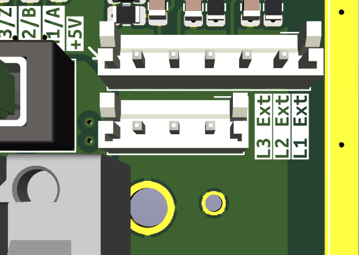{ width="300" align=left }

!!! info "SIN/COS Encoders"
    This interface is **not** galvanically isolated from the microcontroller.  
    Matching connector is JST EHR 4.  
    Color code of the provided cable is  

    * **+5V** Red  
    * **SIN** Green  
    * **COS** Yellow  
    * **GND** Black  

    Max current delivered by the board internal feeder through the +5V/GND is XXXmA  
    **SIN and COS signal should range from 0v to 2.048V.**  
    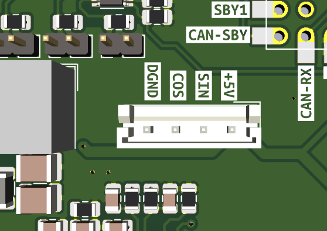{ width="300" align=left }

!!! info "Max current selection"
    Max current sensed can be selected through solder jumpers.  
    Solder jumpers are marked **SJ** on the PCB.  
    
    * If the solder jumps are bridged, max current is +/- 50 Amps  
    * If the solder jumps are not bridged, max current is +/- 20 Amps  
    
    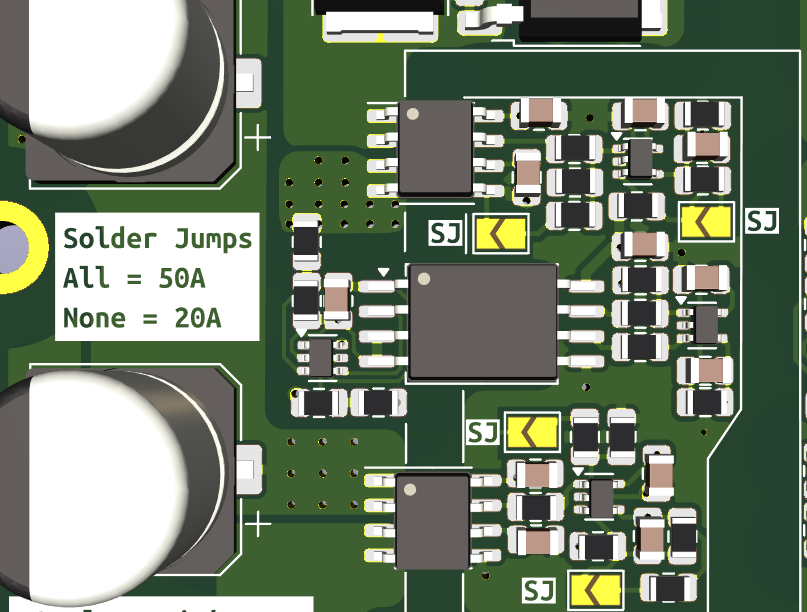{ width="300" align=left }

!!! info "External voltage measurements"
    User can select if voltage measurement is taken at the switching node or externally after a custom filter.  

    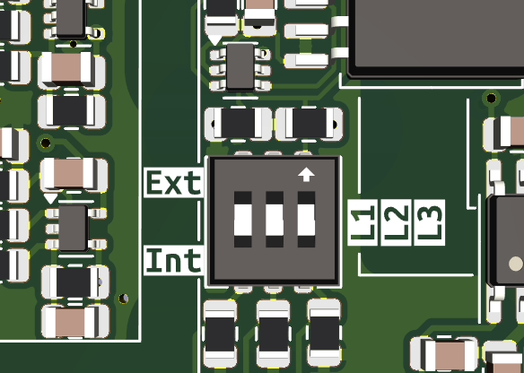{ width="300" }  

    External measurement are cabled through a dedicated connector labeled L1 Ext, L2 Ext, L3 Ext  
    These cables are meant to be tied after a custom filter.  
    
    * Min sensed voltage is 0V.  
    * Max sensed voltage is 100V.  
    
    Matching connector is JST EHR 3.  
    Color code of the provided cable is  

    * **L1 Ext** Yellow  
    * **L2 Ext** Brown  
    * **L3 Ext** Green  

    { width="300" align=left }

!!! info "Fuses"
    Two fuses ratings are provided with the Ownverter board.  
    
    * 15A fuses are meant to be equipped when max current is +/- 20 Amps  
    * 30A fuses are meant to be equipped when max current is +/- 50 Amps  
    
    Fuse series is Littelfuse MINI 997  
    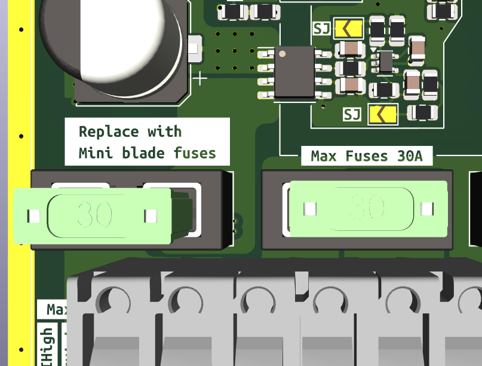{ width="300" align=left }

!!! info "RJ45 connectors"
    Recommended cables are **S / FTP** RJ45 cables.  
    S / FTP means that the shielding is double:  
    
    * Overall copper braid shielding 
    * and shielding on each pair.  
    
    Unlike the RJ45 F/FTP computer cable, the S/FTP cable has a drain conductor. 
    This allows any interference to be moved to ground, reducing potential interferences.  
    
    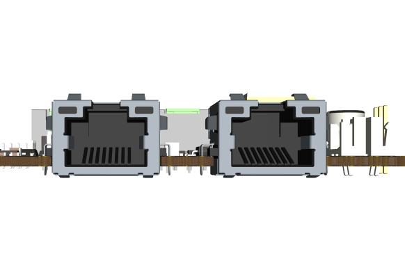{ width="300" align=left }

!!! info "Termination resistors"
    Headers marked **CAN** and **RS485** are 120 Ohm termination resistance jumpers.  
    They should be set for first and last modules when power modules are daisy chained.  
    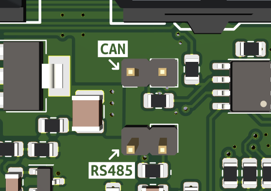{ width="300" align=left }

!!! info "External heatsink"
    Power dissipation can be mounted on the bottom side on the board.  
    **Pads should be covered by an electrically isolating thermal interface material.**  
    Advised method is to use thermal interface double side duct tape.  
    Mounting holes can be used to fasten any heatsink in place. Refer to the mechanical drawing for drill map.  
    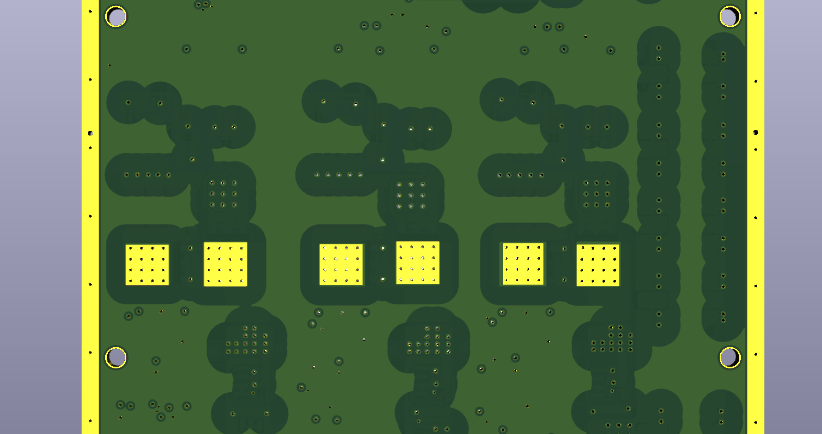{ width="300" align=left }

---
## Converter Pinout

The OWNVERTER converter pinout is shown in the image below.

!!! info "Converter pins"
    !!! danger "Power Pins"
        - **Vhigh** is the high side voltage
        - **A+/B+/C+** are the low side voltages. They are connected to the motor phases.
        - **GND** is the power GND
        - **Feeder 6V** is the 6V output of the embedded feeder
        - **D6V** is the input of the digital 6V. You can feed it from an outside source.
        - **DGND** is the digital ground
    !!! success "Data Pins"
        - **CAN1 and CAN2** the two pins of the CANBus
        - **RS485 +/-** the two pins of the RS485 bus.
        - **Analog +/-** the two pins of the analog bus.
        - **Sync I/0** the pin through which boards synchronize. It is the same pin for both master and slave operation.
        - **DGND** is the digital ground

---
## Electrical Specifications

### Absolute Maximum Ratings
!!! warning "Absolute Maximum Ratings"
    | Parameter                             | Min | Typ | Max | Unit |
    |-----------                            |-----|-----|-----|------|
    | _Low-Side peak Voltage_                    | - | - | 92 | VDC |
    | _Low-Side RMS Voltage_                    | - | - | 65 | VDC |
    | _High-Side Voltage_                   | 8 | - | 100 | VDC |
    | _Low-Side Peak Current per Channel_   | - | - | 20 | A |
    | _Low-Side RMS Current per Channel_   | - | - | 14.14 | A |
    | _Power Output_                        | - | - | 1.3 | kW |

### Low-Side Ratings
| Parameter | Min | Typ | Max | Unit |
|-----------|-----|-----|-----|------|
| *Number of Power Channels* | - | - | 3 | - |
| *Voltage Range* | 12 | - | 92 | VDC |
| *(Max Low-Side Peak Current per Channel)* | - | - | 20 | A |

### High-Side Ratings
| Parameter | Min | Typ | Max | Unit |
|-----------|-----|-----|-----|------|
| *Number of Power Channels* | - | - | 1 | - |
| *Voltage Range* | 12 | - | 100 | VDC |
<!-- | *Voltage Ripple* | - | - | 0.3 | VDC | It depends on the modulation-->

### Switching Characteristics
| Parameter | Min | Typ | Max | Unit |
|-----------|-----|-----|-----|------|
| *Switching Frequency* | - | 200 | - | kHz |
| *Selectable Deadtime (20kΩ resistor)* | - | 200 | - | ns |
| *Maximum Gate Current* | - | 4 | - | A |

### Temperature and Dimensions
| Parameter | Min | Typ | Max | Unit |
|-----------|-----|-----|-----|------|
| *Operating Temperature* | -20 | - | +60 | °C |
| *Cooling Principle* | - | Natural Convection | - | - |
| *Dimensions (L x W x H)* | 100 x 100 x 35 | - | - | mm |

### Protection Features
| Parameter | Min | Typ | Max | Unit |
|-----------|-----|-----|-----|------|
| *High-Side Fuse (Tamb = 25°C)* | - | 25 | - | A |
| *Low-Side Fuse (Tamb = 25°C)* | - | 25 | - | A |

---
## Communication Specifications

### CAN-FD
| Type | Parameter | Min | Typ | Max | Unit |
| ------ |-----------|-----|-----|-----|------|
| *CAN-FD* |  Baudrate | 500 | 500 | - | kBauds |
| *Halh Duplex RS485* | Baudrate | 10 | 20 | - | MBauds |
| *SPI* | Baudrate | 0.5 | - | 20 | MBauds |
| *USART* | Baudrate | - | 115200 | - | Bauds |

---
## Synchronization

Two OWNVERTER Boards can be synchronized via **PWM sinc IN/OUT**. Using a 15cm RJ45 cable, the delay and jitter between the server and the client PWM are measured as follows:

| Parameter | Symbol | Min | Typ | Max | Unit |
|-----------|--------|-----|-----|-----|------|
| *PWM Slew Rate* | - | 660 | - | - | mV/ns |
| *Delay Between Server and Client* | td | - | 24.2 | - | ns |
| *Jitter of PWM Client* | tj | - | 4.8 | - | ns |

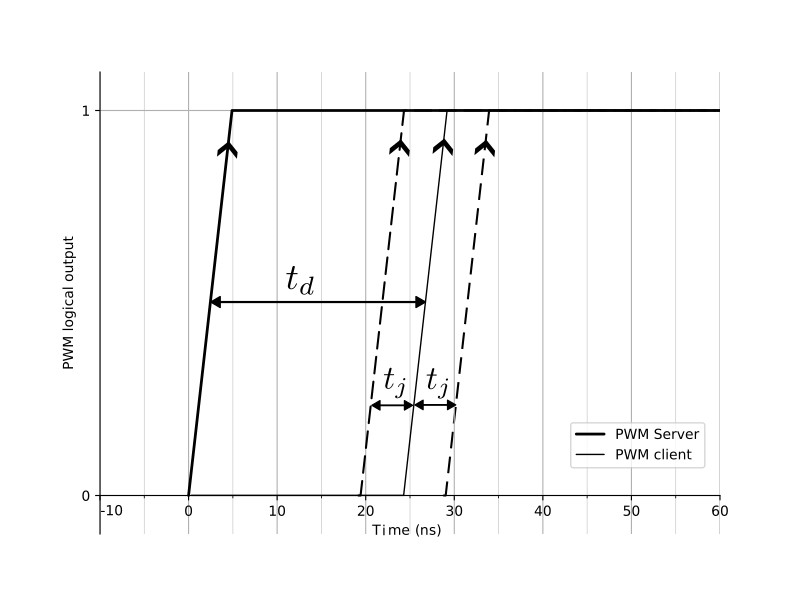

---
## Analog Communication

Analog communication between boards allows voltage and current measurement with **high accuracy**.

**Example Measurement:**
- A **16-bit value** of **2000** is transmitted by a server board.
- Step response from **1V to 1.25V** measured with a **500 MHz oscilloscope**.

| Parameter | Symbol | Min | Typ | Max | Unit |
|-----------|--------|-----|-----|-----|------|
| *Step Response Time to ±5%* | Δt5% | - | 1.7 | - | µs |
| *Steady-State Value* | Vfinal | - | 1.25 | - | V |
| *±5% Steady-State Interval* | ΔV | - | 0.125 | - | V |
| *Bandwidth* | $$fc = \dfrac{3}{2\cdot \pi \cdot \Delta t_{5\%}}$$ | - | 281 | - | kHz |

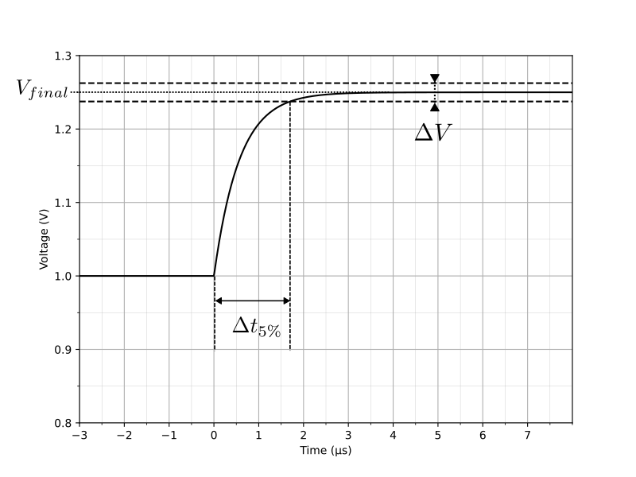

Statistical Distribution of 10235 data samples

| Parameter | Symbol | Min | Typ | Max | Unit |
|-----------|--------|-----|-----|-----|------|
| Mean | $\mu$ | - | 2032.65 | - |  |
| Variance | $\sigma^2$ |  | 0.795 | - |  |

---
## Measurement Chains

The Twist Board implements full observability on all **low-side** and **high-side** power channels using **isolated measurements**.

### ADC Specifications

| Parameter | Value |
|-----------|-------|
| ADC Technology | Successive Approximation (SAR) |
| Independent ADC Peripherals | 5 |
| Number of Channels per ADC | 1 to 6 |
| Sampling Time | 530 ns |
| Hardware ADC Trigger | Programmable trigger instant on PWM period |
| Number of PWM synchronized ADCs | 2 |
| Software ADC Trigger | All ADC peripherals |
| Trigger Event Typical Frequency | 200 kHz |

### Measurement Points

| Measurement | Description | Sensor Technology | Bandwidth (kHz) | Signal Side Amplitude | Full Scale Range | Unit |
|-------------|-------------|--------------------|----------------|-------------|-----------| ---- |
| VILow1 | Phase A Low-side voltage | Voltage divider & isolation amplifier | 60 | ±250 mV | ±80 | V |
| iILow1 | Phase A Low-side current | Isolated Hall effect sensor | 1000 | ±20 A | ±20 | A |
| VILow2 | Phase B Low-side voltage | Voltage divider & isolation amplifier | 60 | ±250 mV | ±80 | V |
| iILow2 | Phase B Low-side current | Isolated Hall effect sensor | 1000 | ±20 A | ±20 | A |
| VILow2 | Phase C Low-side voltage | Voltage divider & isolation amplifier | 60 | ±250 mV | ±80 | V |
| iILow2 | Phase C Low-side current | Isolated Hall effect sensor | 1000 | ±20 A | ±20 | A |
| VIHigh | High-side voltage | Voltage divider & isolation amplifier | 100 | +2 V | 120 | V |
| iIHigh | High-side current | Isolated Hall effect sensor | 1000 | ±20 A | ±20 | A |
| Temp1 | LEG1 Temperature | NTC Thermistor |  |  | -40 to +110  | $\degree C$ |
| Temp2 | LEG2 Temperature | NTC Thermistor |  |  | -40 to +110  | $\degree C$ |
| Temp3 | LEG2 Temperature | NTC Thermistor |  |  | -40 to +110  | $\degree C$ |

Schematic showing where the measurements are performed on the circuit.

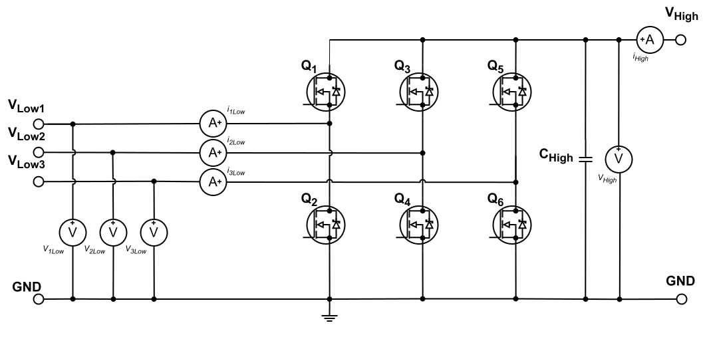

!!!info "Measurements location and convention"
    - **Voltage sensors** - they measure phase voltage of the motor.
    - **Low-side Current sensors** - they measure phase current of the motor.
        Their output is *positive* when the inverter is in **Source mode (current going OUT of the low side)**.
    - **High-side Current sensor** - it is connected right after the high-side connector.
        Its output is *negative* when the converter is in **BUCK mode (current going IN the high side)**.

Image showing where the measurements can be accessed on the board.

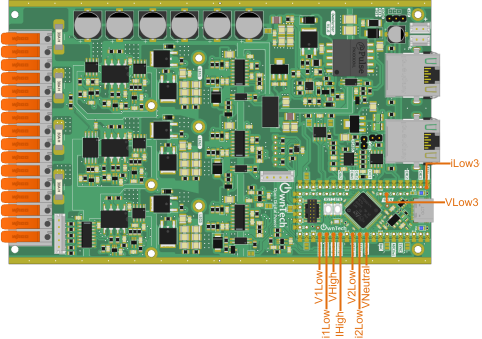

!!!note "Measurement pins"
    All measurements have pins which can be easily accessed with a probe (oscilloscope or multimeter) as shown below.

    !!! warning "Use ground springs for noise reduction"

    

### Standard Deviation of Measurements

| Parameter | Not Averaged | Avg of 2 Measures | Avg of 3 Measures | Avg of 5 Measures | Avg of 10 Measures |
|-----------|-------------|-------------------|-------------------|-------------------|--------------------|
| VILow1 | 85 mV | 61 mV | 50 mV | 39 mV | 28 mV |
| VILow2 | 82 mV | 58 mV | 47 mV | 37 mV | 27 mV |
| VILow2 | 82 mV | 58 mV | 47 mV | 37 mV | 27 mV |
| VIHigh | 150 mV | 108 mV | 88 mV | 68 mV | 48 mV |
| IILow1 | 34 mA | 24 mA | 20 mA | 16 mA | 11 mA |
| IILow2 | 34 mA | 24 mA | 20 mA | 15 mA | 11 mA |
| IILow2 | 34 mA | 24 mA | 20 mA | 15 mA | 11 mA |
| IIHigh | 14 mA | 10 mA | 8 mA | 6 mA | 4 mA |

### Relative accuracy of voltage and current measurements

The following graphs give the accuracy of the voltage and current measurements for different levels of current and voltage for the TWIST board for reference only. Measurements for the OWNVERTER board are ongoing.

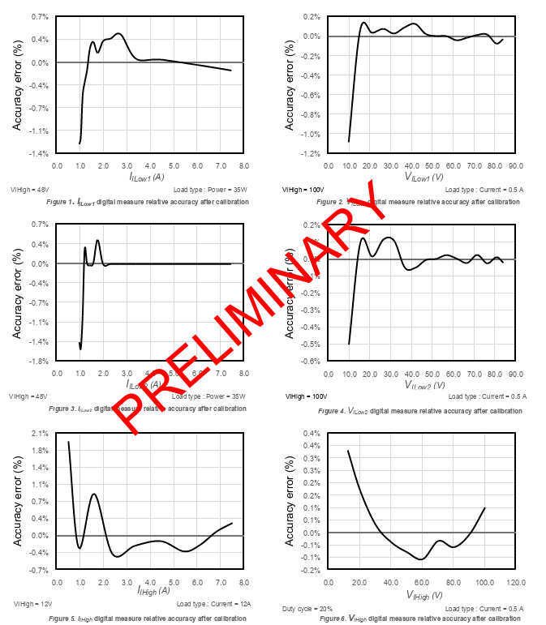

### Theoretical Calibration Parameters

By default all OWNVERTER boards can be calibrated using the following parameters.

| Variable Name | Gain     | Offset   | Unit  |
|--------------|---------|----------|------|
| VLow1        | 0.05134   | -97.868  | V    |
| VLow2        | 0.05134   | -97.868  | V    |
| VLow3        | 0.05134   | -97.868  | V    |
| VHigh        | 0.029964 | 0       | V    |
| ILow1        | 0.01   | -20      | A    |
| ILow2        | 0.01   | -20      | A    |
| ILow3        | 0.01   | -20      | A    |
| IHigh        | 0.01   | 20      | A    |

---

## Typical Applications

| Mode Name | High Side | Low Side | Sensor type | Typical Application |
|-----------|----------|---------|---------| -----------|
| 3 phase inverter | Input | Output | HAL | BLDC Motor |

### Example wiring diagram and schematic of the Twist board in Buck mode

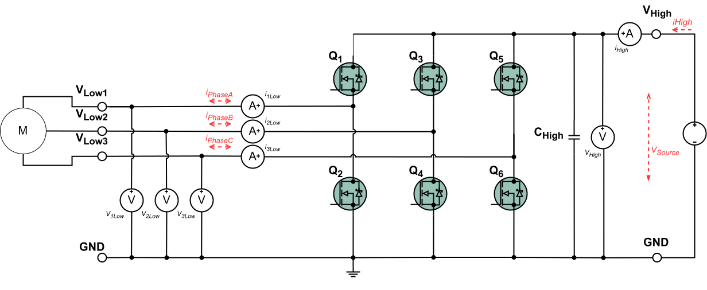

---
## Revision History

| Date | Revision | Changes |
|------|----------|---------|
| 07-Fev-2025 | 1 | Initial Release |

**License:** Documentation licensed under Creative Commons SA-BY

